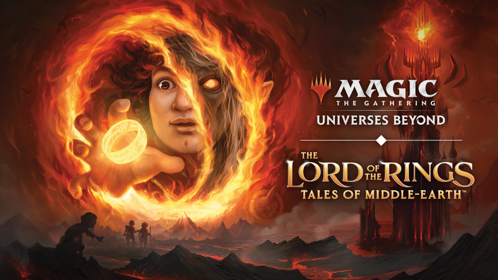

# Magic-The-Gathering-Deck

# Magic: The Gathering Deck Manager - Lord of the Rings Edition

## Introduction
Welcome to the Magic: The Gathering (MTG) Deck Manager - Lord of the Rings Edition! This project is designed to help you organize and manage your decks for the popular collectible card game Magic: The Gathering, with a special focus on incorporating the enchanting world of Lord of the Rings.

## Table of Contents
- [Introduction](#introduction)
- [Features](#features)
- [Installation](#installation)
- [Usage](#usage)
- [Contributing](#contributing)
- [License](#license)

## Features
- Deck Creation: Create new decks by selecting cards from both the Magic: The Gathering and Lord of the Rings card databases.
- Deck Customization: Add, remove, or modify cards within your decks to create a perfect synergy between the two universes.
- Deck Statistics: Track important statistics, such as deck size, mana curve, and color distribution, to optimize your strategies.
- Card Search: Explore extensive libraries of Magic: The Gathering and Lord of the Rings cards, filtering by attributes such as card type, rarity, or abilities.
- Deck Import/Export: Import or export your decks in popular formats like MTG Arena, Cockatrice, or text files for easy sharing and collaboration.
- Deck Validation: Ensure your deck complies with the rules of the game, including restrictions on card types, banned cards, and deck size.
- Lord of the Rings Integration: Discover unique Lord of the Rings cards, characters, and lore, seamlessly blending them with the MTG mechanics.
- Card Recommendations: Receive suggestions and recommendations for cards that complement your existing deck composition.
- Deck Analysis: Analyze your deck's performance and receive insights on its strengths, weaknesses, and potential improvements.
- Deck Sharing: Share your decks with other players, discuss strategies, and gain inspiration from the vibrant community.

## Installation
...

## Usage
...

## Contributing
...

## License
MIT License